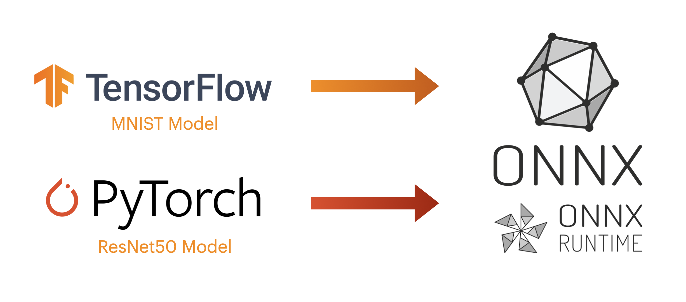
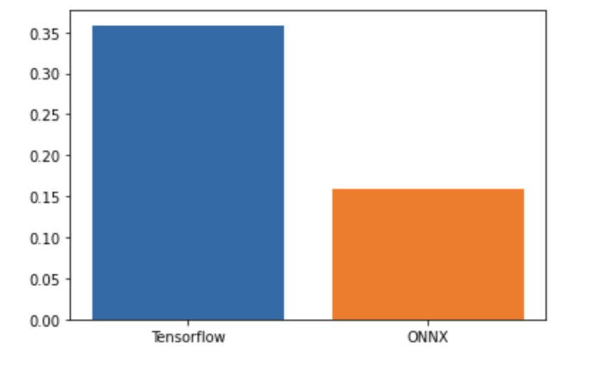
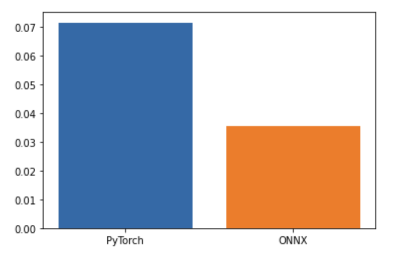

# エッジAI入門＆活用シリーズ#2『ONNXモデル』編
## ONNXモデルと既存ディープラーニングモデルとの性能比較
Site : [https://algyan.connpass.com/event/258978/](https://algyan.connpass.com/event/258978/)



### Tensorflow vs ONNX
- MNIST Model(CNN)
- Performance Comparing 1. Accuracy 
- Performance Comparing 2. Speed

### PyTorch vs ONNX
- ResNet50 Model 
- Performance Comparing 1. Accuracy 
- Performance Comparing 2. Speed

### Dependency
* Tensorflow 2.9.1
* tf2onnx 1.12.1
* Python 3.8
* PyTorch 1.12.1
* onnx 1.12.0
* onnxruntime 1.12.1 
 
### Tensorflow to ONNX
```python
import tf2onnx

!python -m tf2onnx.convert --saved-model tf_model --output onnx_model.onnx --opset 15 # version
```

### PyTorch to ONNX
```python
# Random torch input data
input = torch.rand(1,3,224,224)

# Convert Pytorch model to ONNX
torch.onnx.export(torch_model, input, 'onnx_resnet.onnx')
```


### Comparing Inference Speed
  
